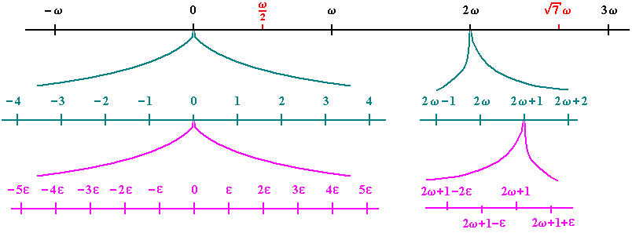

# Hyperreal Number Implementation in Zig

## Project Summary

This Zig project implements a basic representation of hyperreal numbers and demonstrates arithmetic operations with them. The main components are:

1. A `Hyperreal` struct that represents hyperreal numbers.
2. Basic arithmetic operations (addition, subtraction, multiplication, and division) for hyperreal numbers.
3. A custom formatting function for printing hyperreal numbers.
4. A main function that demonstrates the usage of hyperreal numbers and their operations.

## Hyperreal Numbers

Hyperreal numbers are an extension of the real number system that includes infinitesimals and infinities. Key points about hyperreal numbers in this implementation:

### Representation

A hyperreal number is represented as `a + bε`, where:
- `a` is the real part (a standard real number)
- `b` is the coefficient of the infinitesimal part
- `ε` represents an infinitesimal value (conceptually smaller than any positive real number but larger than zero)

For a visual representation of how hyperreal numbers extend the real number line, see the image below:



### Properties

- Infinitesimals allow for a rigorous treatment of limits and infinitesimal calculus.
- They extend real numbers to include values that are infinitely small or infinitely large.

### Current Limitations

This implementation focuses solely on infinitesimals (ε) and does not yet incorporate the concept of omega (ω) to represent infinite quantities. As a result:

1. The current model can represent infinitesimally small numbers but not infinitely large ones.
2. Operations involving infinity or comparisons with infinite quantities are not supported.
3. The full power of hyperreal arithmetic, which includes both infinitesimals and infinities, is not realized.

To fully leverage the hyperreal number system, future improvements could include:
- Adding support for ω to represent infinity.
- Implementing operations that combine ε and ω.
- Extending the arithmetic operations to handle infinite quantities.

### Implementation Note

This is a simplified representation of hyperreal numbers. In practice, hyperreal numbers involve more complex mathematical structures and properties. This implementation demonstrates the basic concept in code, focusing on infinitesimals.

## Usage

To run the project, use the following command:

```
zig run src/main.zig
```